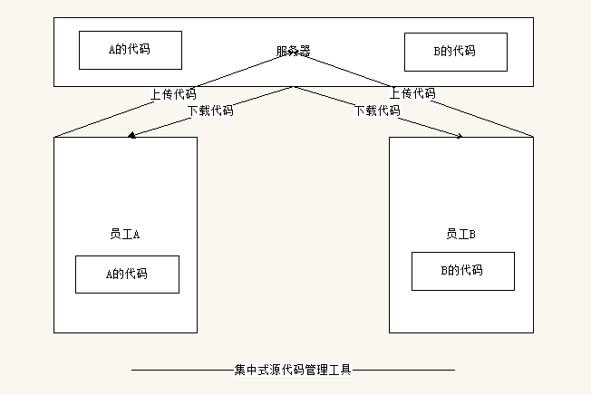
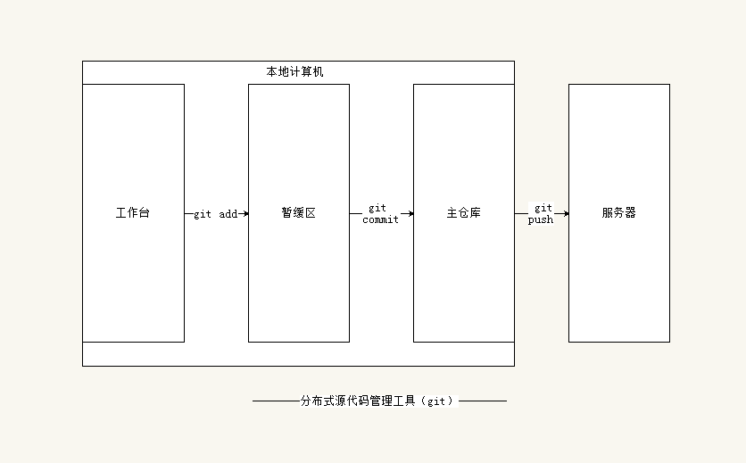

#Git学习#

#首先你得有个 [Git](https://git-scm.com/downloads)#

##一、bash命令##

>1.打印当前活动目录
>`$ pwd`
>
>2.列举当前活动目录下的文件夹和文件
>`$ ls(list)`
>
>3.'.'表示当前目录,'..'表示上一级目录
>
>4.切换活动目录
>`$ cd(change the shell working directory)`
>
>5.$ 命令 -选项1 -选项2 == $ 命令 -选项1选项2
>`$ ls -a -l || $ ls -al (列举出当前活动目录下的所有文件夹和文件，并显示详细信息，同时包含两个文件夹：同级和上级目录[./和../])`
>
>6.创建文件夹，可以用空格连续创建多个文件夹，。默认只能在已有的目录中创建，也可以跟一个'-p'在一个不存在的目录中创建
>`mkdir(make directory) 文件夹名 文件夹名 `
>
>7.删除空文件
>`rmdir 文件夹名（remove directory）`
>
>8.递归删除当前文件夹内文件或文件夹，从当前目录下面最底层开始递归删除
>`rm -rf 文件夹（remove recursive force）`
>
>9.创建文件
>`touch 文件夹/文件名`
>
>10.复制文件	
>`cp 源文件 新路径（copy）`
>
>11.移动文件
>`mv 源文件 新路径(move)`
>
>12.vim编辑器基本操作
>`vi 可编辑文件`
>*输入i||a||s进入编辑*
>*esc退出编辑*
>*:w保存 :q退出 :wq保存并退出*
>

##二、Git概念及常用命令##

###概念###

* 代码管理种类

> 本地源代码管理
> 集中式源代码管理工具（svn）
> 分布式源代码管理工具（git）

* 分布式源代码管理工具，利于个人和团队之间的协助开发
>Workspace：工作区
>Index / Stage：暂存区
>Repository：仓库区（或本地仓库）
>Remote：远程仓库
---

---

###常用命令###

1.新建代码库
>在当前目录新建一个Git代码库
>$ git init
>
>新建一个目录，将其初始化为Git代码库
>$ git init [project-name]
>
>下载一个项目和它的整个代码历史
>$ git clone [url]
>
---
2.配置
*Git的设置文件为.gitconfig，它可以在用户主目录下（全局配置），也可以在项目目录下（项目配置）*
>显示当前的Git配置
>$ git config --list
>
>编辑Git配置文件
>$ git config -e [--global]
>
>设置提交代码时的用户信息
>$ git config [--global] user.name "[name]"
>$ git config [--global] user.email "[email address]"
---
3.增加/删除文件
>添加指定文件到暂存区
>$ git add [file1] [file2] ...
>
>添加指定目录到暂存区，包括子目录
>$ git add [dir]
>
>添加当前目录的所有文件到暂存区
>$ git add .
>
>添加每个变化前，都会要求确认
>对于同一个文件的多处变化，可以实现分次提交
>$ git add -p
>
>删除工作区文件，并且将这次删除放入暂存区
>$ git rm [file1] [file2] ...
>
>停止追踪指定文件，但该文件会保留在工作区
>$ git rm --cached [file]
>
>改名文件，并且将这个改名放入暂存区
>$ git mv [file-original] [file-renamed]
---
4.四、代码提交
>提交暂存区到仓库区
>$ git commit -m [message]
>
>提交暂存区的指定文件到仓库区
>$ git commit [file1] [file2] ... -m [message]
>
>提交工作区自上次commit之后的变化，直接到仓库区
>$ git commit -a
>
>提交时显示所有diff信息
>$ git commit -v
>
>使用一次新的commit，替代上一次提交
>如果代码没有任何新变化，则用来改写上一次commit的提交信息
>$ git commit --amend -m [message]
>
>重做上一次commit，并包括指定文件的新变化
>$ git commit --amend [file1] [file2] ...
---
5.分支
>列出所有本地分支
>$ git branch
>
>列出所有远程分支
>$ git branch -r
>
>列出所有本地分支和远程分支
>$ git branch -a
>
>新建一个分支，但依然停留在当前分支
>$ git branch [branch-name]
>
>新建一个分支，并切换到该分支
>$ git checkout -b [branch]
>
>新建一个分支，指向指定commit
>$ git branch [branch] [commit]
>
>新建一个分支，与指定的远程分支建立追踪关系
>$ git branch --track [branch] [remote-branch]
>
>切换到指定分支，并更新工作区
>$ git checkout [branch-name]
>
>切换到上一个分支
>$ git checkout -
>
>建立追踪关系，在现有分支与指定的远程分支之间
>$ git branch --set-upstream [branch] [remote-branch]
>
>合并指定分支到当前分支
>$ git merge [branch]
>
>选择一个commit，合并进当前分支
>$ git cherry-pick [commit]
>
>删除分支
>$ git branch -d [branch-name]
>
>删除远程分支
>$ git push origin --delete [branch-name]
>$ git branch -dr [remote/branch]
---
6.标签
>列出所有tag
>$ git tag
>
>新建一个tag在当前commit
>$ git tag [tag]
>
>新建一个tag在指定commit
>$ git tag [tag] [commit]
>
>删除本地tag
>$ git tag -d [tag]
>
>删除远程tag
>$ git push origin :refs/tags/[tagName]
>
>查看tag信息
>$ git show [tag]
>
>提交指定tag
>$ git push [remote] [tag]
>
>提交所有tag
>$ git push [remote] --tags
>
>新建一个分支，指向某个tag
>$ git checkout -b [branch] [tag]
---
7.查看信息
>显示有变更的文件
>$ git status
>
>显示当前分支的版本历史
>$ git log
>
>显示commit历史，以及每次commit发生变更的文件
>$ git log --stat
>
>搜索提交历史，根据关键词
>$ git log -S [keyword]
>
>显示某个commit之后的所有变动，每个commit占据一行
>$ git log [tag] HEAD --pretty=format:%s
>
>显示某个commit之后的所有变动，其"提交说明"必须符合搜索条件
>$ git log [tag] HEAD --grep feature
>
>显示某个文件的版本历史，包括文件改名
>$ git log --follow [file]
>$ git whatchanged [file]
>
>显示指定文件相关的每一次diff
>$ git log -p [file]
>
>显示过去5次提交
>$ git log -5 --pretty --oneline
>
>显示所有提交过的用户，按提交次数排序
>$ git shortlog -sn
>
>显示指定文件是什么人在什么时间修改过
>$ git blame [file]
>
>显示暂存区和工作区的差异
>$ git diff
>
>显示暂存区和上一个commit的差异
>$ git diff --cached [file]
>
>显示工作区与当前分支最新commit之间的差异
>$ git diff HEAD
>
>显示两次提交之间的差异
>$ git diff [first-branch]...[second-branch]
>
>显示今天你写了多少行代码
>$ git diff --shortstat "@{0 day ago}"
>
>显示某次提交的元数据和内容变化
>$ git show [commit]
>
>显示某次提交发生变化的文件
>$ git show --name-only [commit]
>
>显示某次提交时，某个文件的内容
>$ git show [commit]:[filename]
>
>显示当前分支的最近几次提交
>$ git reflog
---
8.远程同步
>下载远程仓库的所有变动
>$ git fetch [remote]
>
>显示所有远程仓库
>$ git remote -v
>
>显示某个远程仓库的信息
>$ git remote show [remote]
>
>增加一个新的远程仓库，并命名
>$ git remote add [shortname] [url]
>
>取回远程仓库的变化，并与本地分支合并
>$ git pull [remote] [branch]
>
>上传本地指定分支到远程仓库
>$ git push [remote] [branch]
>
>强行推送当前分支到远程仓库，即使有冲突
>$ git push [remote] --force
>
>推送所有分支到远程仓库
>$ git push [remote] --all
---
9.撤销
>恢复暂存区的指定文件到工作区
>$ git checkout [file]
>
>恢复某个commit的指定文件到暂存区和工作区
>$ git checkout [commit] [file]
>
>恢复暂存区的所有文件到工作区
>$ git checkout .
>
>重置暂存区的指定文件，与上一次commit保持一致，但工作区不变
>$ git reset [file]
>
>重置暂存区与工作区，与上一次commit保持一致
>$ git reset --hard
>
>重置当前分支的指针为指定commit，同时重置暂存区，但工作区不变
>$ git reset [commit]
>
>重置当前分支的HEAD为指定commit，同时重置暂存区和工作区，与指定commit一致
>$ git reset --hard [commit]
>
>重置当前HEAD为指定commit，但保持暂存区和工作区不变
>$ git reset --keep [commit]
>
>新建一个commit，用来撤销指定commit
>后者的所有变化都将被前者抵消，并且应用到当前分支
>$ git revert [commit]
>
>暂时将未提交的变化移除，稍后再移入
>$ git stash
>$ git stash pop
---
10.其他
>生成一个可供发布的压缩包
>$ git archive

##SSH加密##

###概念###
* Github有两种操作方式
  1.https，这种方式可以随意克隆github上的项目，而不管是谁的;在git中pull/push的时候是需要验证用户名和密码的。
  2.SSH：克隆者必须是拥者或管理员，且需要先添加 SSH key ，否则无法克隆。在pull/push的时候不再是验证用户名和密码，而是通过验证ssh的方式来验证用户。

###使用步骤###

* 在git上输入`ssh-keygen -t rsa`，确认目录，默认即可
* 找到生成的SSH目录，用记事本打开'id_rsa.pub'文件，全选复制
* 在github网站中，点击头像，进入'setting'菜单，找到左侧的SSH项
* 添加一个SSH，取一个名称，将刚才复制的'id_rsa.pub'公钥粘贴保存即可
* 在网站个人仓库中选择SSH，复制url
* 在git中`SSH [SSH url]`测试是否成功

#由于网络中git命令大全有很多，在此只是摘抄了大大神[阮一峰](http://www.ruanyifeng.com)老师的[《常用 Git 命令清单》](http://www.ruanyifeng.com/blog/2015/12/git-cheat-sheet.html)的仅作自我学习#